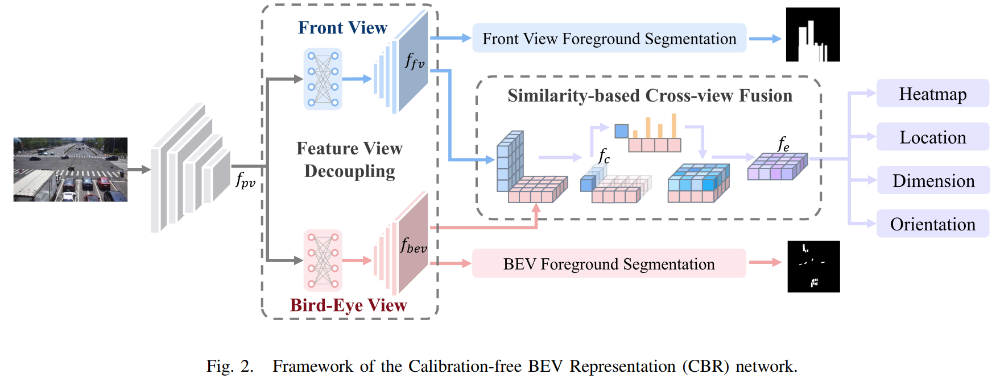
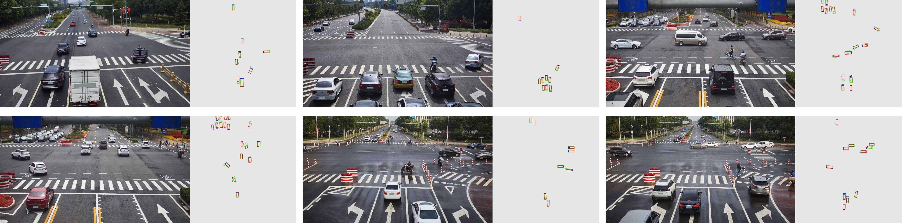
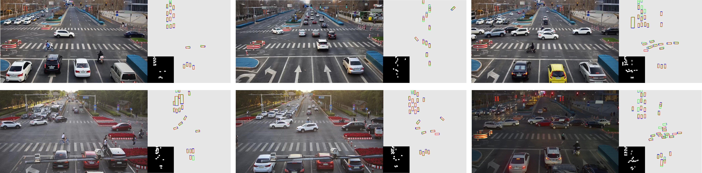

# Calibration-free BEV Representation for Infrastructure Perception



> For technical details, please refer to:
>
> [Calibration-free BEV Representation for Infrastructure Perception](https://arxiv.org/abs/2303.03583)

### (0) Abstract

Effective BEV object detection on infrastructure can greatly improve traffic scenes understanding and vehicle-toinfrastructure (V2I) cooperative perception. However, cameras installed on infrastructure have various postures, and previous BEV detection methods rely on accurate calibration, which is difficult for practical applications due to inevitable natural factors (e.g., wind and snow). In this paper, we propose a Calibration-free BEV Representation (CBR) network, which achieves 3D detection based on BEV representation without calibration parameters and additional depth supervision. Specifically, we utilize two multi-layer perceptrons for decoupling the features from perspective view to front view and bird-eye view under boxes-induced foreground supervision. Then, a cross-view feature fusion module matches features from orthogonal views according to similarity and conducts BEV feature enhancement with front view features. Experimental results on DAIR-V2X demonstrate that CBR achieves acceptable performance without any camera parameters and is naturally not affected by calibration noises. We hope CBR can serve as a baseline for future research addressing practical challenges of infrastructure perception.


### (1) Setup

This code has been tested with Python 3.8.10, Pytorch 1.11.0, CUDA 11.7.

* Setup environment
    ```bash
    conda create -n CBR python=3.8.10
    source activate CBR
    ```

* Clone the respository

* Install the requirements
    ```
    pip install -r requirements.txt
    ```

* Dataset
    * Download [DAIR-V2X dataset](https://github.com/AIR-THU/DAIR-V2X#dataset-download-)
    * Generate KITTI-format data for DAIR-V2X-C following the [guidelines](https://github.com/AIR-THU/DAIR-V2X/blob/main/configs/vic3d/late-fusion-image/imvoxelnet/README.md#create-kitti-format-data-option-for-model-training). If you want to conduct experiments on DAIR-V2X-I, you should also generate the corresponding KITTI-format data.
    * Create a symlink
        ```bash
        # For DAIR-V2X-C
        cd datasets/dair_c_inf/training
        ln -s ${DAIR-V2X-C_KITTI_ROOT}/cooperative-vehicle-infrastructure/training/image_2 ./image_2
        ln -s ${DAIR-V2X-C_KITTI_ROOT}/cooperative-vehicle-infrastructure/training/label_2 ./label_2

        # For DAIR-V2X-I
        cd datasets/dair_i/training
        ln -s ${DAIR-V2X-I_KITTI_ROOT}/single-infrastructure-side/training/image_2 ./image_2
        ln -s ${DAIR-V2X-I_KITTI_ROOT}/single-infrastructure-side/training/label_2 ./label_2
        ```
    * Generate foreground segmentation labels
        ```bash
        cd tools
        # For DAIR-V2X-C
        python gen_bevseg_gt.py
        python gen_fvseg_gt.py

        # For DAIR-V2X-I
        python gen_bevseg_gt.py --dataset dair_i
        python gen_fvseg_gt.py --dataset dair_i
        ```

### (2) Experiments on DAIR-V2X-C
* Training
    ```bash
    CUDA_VISIBLE_DEVICES=0 python train.py
    ```
* Evaluation
    ```bash
    CUDA_VISIBLE_DEVICES=0 python eval.py
    ```
* Visualization
    ```bash
    CUDA_VISIBLE_DEVICES=0 python eval.py --vis
    ```
    

### (3) Experiments on DAIR-V2X-I
* Training
    ```bash
    CUDA_VISIBLE_DEVICES=0 python train.py --dataset dair_i
    ```
* Evaluation
    ```bash
    CUDA_VISIBLE_DEVICES=0 python eval.py --dataset dair_i --pretrained_path ./pretrained/dair_i/
    ```
    > Download the pretrained model for DAIR-V2X-I from [key:mrmc](https://pan.baidu.com/s/1X6KwJVwGGr7Ac0WBzaCV_w) and put them in './pretrained/dair_i/'.
* Visualization
    ```bash
    CUDA_VISIBLE_DEVICES=0 python eval.py --dataset dair_i --pretrained_path ./pretrained/dair_i/ --vis
    ```
    


## Citation

If you find our work useful in your research, please consider citing:

```
@article{fan2023calibration,
  title={Calibration-free BEV Representation for Infrastructure Perception},
  author={Fan, Siqi and Wang, Zhe and Huo, Xiaoliang and Wang, Yan and Liu, Jingjing},
  journal={arXiv preprint arXiv:2303.03583},
  year={2023}}
```

### Acknowledgment

Part of our code refers to the work [PYVA](https://github.com/JonDoe-297/cross-view)
